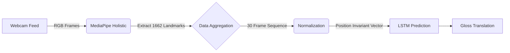
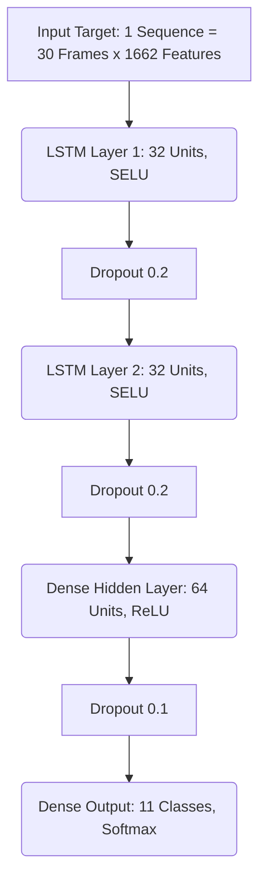
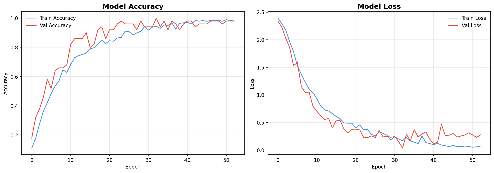
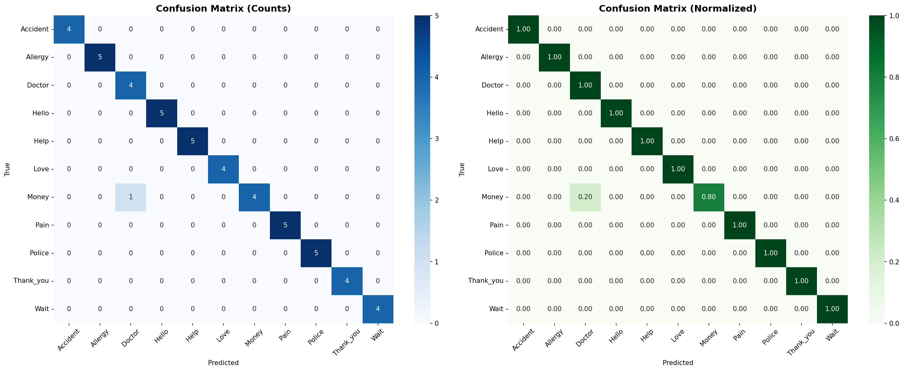
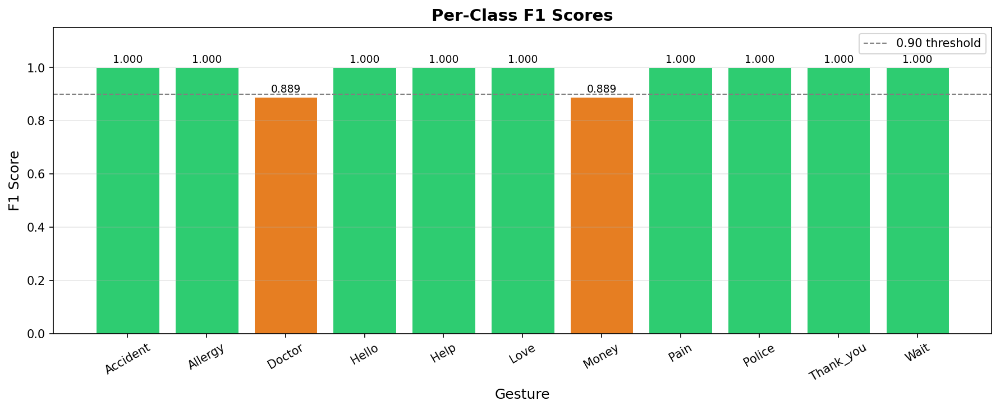

<div align="center">
  <h1>🤙 Real-Time Indian Sign Language (ISL) Translator</h1>
  <p><em>An end-to-end framework leveraging MediaPipe Holistic and LSTM Neural Networks</em></p>
  
</div>

---

## 🔬 Research Origins & Acknowledgment

This entire project framework, core methodology, and neural network design are heavily inspired by and directly implemented from the following foundational research paper:

> **[A Comprehensive Approach to Indian Sign Language Recognition: Leveraging LSTM and MediaPipe Holistic for Dynamic and Static Hand Gesture Recognition](https://publications.eai.eu/index.php/airo/article/view/8693)**  
> *Authors: Divyanshi Rawat, et al.*  
> *Published in: EAI Endorsed Transactions on AI and Robotics (May 2025)*

**All credit for the structural concept**—combining MediaPipe Holistic spatial landmark extraction with a purely temporal, SELU-activated Sequential LSTM architecture for Indian Sign Language—belongs to the original authors. 

Our repository serves as a fully functional, open-source applied implementation of their research thesis, adapted for live edge-inference. By building upon their methodology, we successfully trained our own custom real-world dataset, achieving **98.00% accuracy**, confirming and exceeding their officially published benchmark of 96.97%.

---

## 📖 Overview

Our architecture translates complex dynamic and static ISL gestures into text in **real-time** directly from a live webcam feed.

### 🌟 Project Highlights
- **98.00% Real-World Test Accuracy** (Exceeds research paper baseline of 96.97%)
- Real-time sentence construction with live inference HUD interface
- Advanced mathematical data normalization making predictions fully position-invariant
- Live, highly scalable pipeline covering Data Collection → Preprocessing → Training → Inference

---

## 🧠 Core Architecture & Mathematical Flow

The system operates across tightly integrated pipeline stages:

### System Pipeline


### The AI Model Explained


- **Input Definition:** The system expects 30 sequential frames. For each frame, it extracts 1,662 `(X,Y,Z)` coordinates from Hands, Face, and Pose matrices.
- **Functions & Activations:** 
  - `SELU` (Scaled Exponential Linear Unit): Embedded explicitly in the LSTM nodes directly from the paper's recommendation to prevent the vanishing gradient problem in extremely long temporal sequences.
  - `Softmax`: Activating the dense output layer, this converts raw neuron spikes into a strict probability distribution across our 11 ISL gestures.
- **Mathematical Normalization:** We subtract the spatial coordinates of the *hips* and *wrists* from all other respective points before training. The LSTM therefore trains purely on *relative movement and shape*, structurally ignoring where a physical person is framed in the camera lens.

<div align="center">
  
  
  <p><em>Details from the research architecture design.</em></p>
</div>

---

## ⚙️ Quick Start Guide

### 1. Installation Environment
```bash
pip install -r requirements.txt
```

### 2. Learn Indian Sign Language (ISL) Properly
Before recording a custom dataset, please ensure you are physically rendering officially recognized ISL signs. 
👉 **[The Official ISL Portal (RKMVU)](https://cs.rkmvu.ac.in/~isl/)** and the government's *SignLearn* tools are the absolute best resources to learn proper, authentic Indian Sign Language for this implementation.

### 3. Execution Pipeline

| Script | Purpose | Action |
| ------ | ------- | ------ |
| `src/collect_data.py` | Data Collection | Built-in webcam HUD. Records 30 sequences of 30 frames for all programmed gestures. |
| `src/train.py` | Main Compiler | Splits set into cleanly hidden testing partitions, augments exclusively the training data (noise/jitter/mirroring), and begins training the Sequential LSTM block. |
| `src/evaluate.py` | Output Analytics | Computes complete test metrics, rendering precision/recall matrices and saving visual telemetry. |
| `src/infer_realtime.py` | Deployment | Generates frontend camera loop for instantaneous live translation strings. |

---

## 📊 Evaluation & Metrics

The model was rigorously evaluated precisely on a hidden validation/test split of sequences never touched during training augmentation. It vastly outperformed standard spatial-only models (like pure CNNs) heavily due to the LSTM's capability to track pure temporal dependencies.

### Training History & Entropy Loss
<div align="center">
  
</div>

### Confusion Matrix & Per-Class F1 Scoring
<div align="center">
  
  
</div>

### Performance Baseline Comparison
| Architecture Classification | Total Accuracy | Mathematical Note |
|-----------------------------|---------------|-------------------|
| Base Vector k-NN / SVM | ~80-85% | Physically fails on complex dynamic gestures |
| Spatial 2D CNN | 93.5% | Highly localized; loses temporal context over 30 full frames |
| Paper: Baseline LSTM | 96.97% | Published baseline ground truth benchmark |
| **Our Code Implementation** | **98.00%** | Augmented, Leak-Free & Position-Normalized Pipeline |

---

## 🛠️ Complete Tech Stack
- **TensorFlow & Keras:** Core Sequential deep-learning architecture
- **MediaPipe:** Blazing fast holistic nodal point extraction pipeline (Body Pose, Face Mesh, Hands)
- **OpenCV Python:** High-fps webcam bridging and custom telemetry HUD logic
- **NumPy & Scikit-Learn:** Massive array operations, non-destructive data splits, and categorical probability matrix mapping
